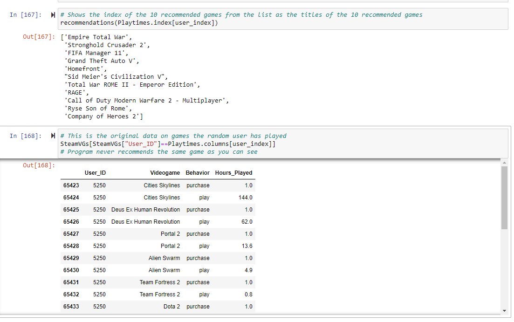
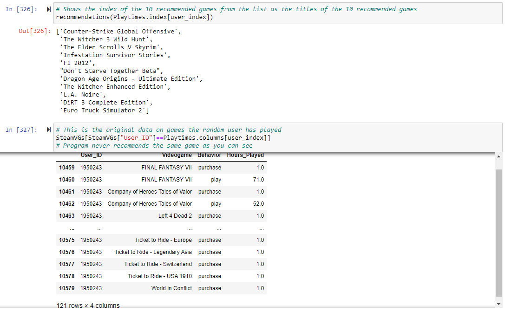

# Videogame-Recommendations-Using-Steam-Data
Recommending videogames to Steam users using Steam data from this Kaggle dataset: https://www.kaggle.com/datasets/tamber/steam-video-games/data

## Introduction 

"Steam is the ultimate destination for playing, discussing, and creating games." 
Steam is a digital videogame service developed by Valve Cortporation to provide updates for their games, but expanded to third-party titles in late 2005 from Triple A games to indie games in 2005. It's a very important and trusted in the gaming space, as well as biggest game catalog storefront. 

## Business Problem

According to Steam's latest user data, there are 132 million monthly active users on Steam. With 73,000 videogames, how do you know what recommend each user? Play it safe with the most popular games? What about trending games? Rating wise? 

After seeing many post online about the confusing recommendations and endless scrolling for new games, Steam has tasked me to attempt making a greater recommendation system/improve the current one. This recommendation is targeted to the gamers of Steam-- who are balanced between the players who buy every game on Steam and the players who play 1 to a handful of games-- that look for interesting new games every now and then more that brand new dopamine adventure. The goal of this rec. system is to provide games to that type of user without them having to scroll for 30 minutes just to give up without finding anything to put on their wish list/cart. Basically, the recommendation system will do the "interesting game search" for them in real-time as their videogame library changes. 

As far as Steam's current recommendation system (popularity, trending/new, ratings), these aren't bad recommendations as highly praised games are most likely going to be liked by most people, but not _everyone_. Steam also has a content-based rec. system based on tags of games a user has played. At the moment, there are no user-based rec. systems, and having one would definitely be a good play.

## Limitations

In the dataset on Steam data from kaggle, there are no limitations at alll. Its a perfectly clean dataset with exactly 200k rows on users game purchases and playtimes. 

Well, unless the fact that there are 129k instances of purchasing games and only 70,000 of those instances get played across the entire dataset counts as one, but that doesn't affect the dataset and the recommendations at all.

## Analysis

Using the dataset, I have found out that-

- 12.4k users
- 5,155 videogames
- Purchase count is 129.5k,  Play count is 70.4k
- So there is 59.1k instances of purchasing without playing...

Outliers -

- Highest purchase count is 1k games (User only played half of them lol) 
- Highest total playtime is 11.7k hour
- Most played game has 980k hours, 2nd most has only 322k
- Most frequent game appeared 9.6k times, second highest is only half of that (4.8k)

Random FYIs -

- 572 users have purchased a game, but never played it
- 1.8k instances of a game being played 6 minutes or less
- 848 games played 6 minutes or less
- 655 games appear once
- Some a thing rows in the data aren't videogames (doesn't affect rec. system)

## Methods

Recommendation System itself pretty much, how it runs on cosine similarity

This recommendation system is built on cosine similarity, metric to measure how similar two items are,to find the most similar videogames based on the playtimes of each user and recommend games from that data.

Cosine similarity works by plotting various data points comparing all of the data Xs and Ys (Being user and videogame playtime data for each game). After plotting the data, it begins to look for most similar videogame by comparing the calculated vectors. The smaller the angle of two points, the greater the cosine similarity. In layman's terms, basically, the closer 2 points are in a multidimensional space, the more similar those points are. 

Visual example of cosine similarity on x1 and x2:

## Visualizations

#### (Randomly selected index recommendations comparison to currently played games)
User 5250's recommendations:

User 1950243's recommendations:

Looking at these 2 randomly selected users, the games chosen tend to be related to the user's games for the most part. Instead of focusing on what's popular, it recommends game's companies seem to have be Triple A to Indie, short, long, open ended, and even follow the same genre depending on the user's playtimes. 

## Limitations/Future Analysis

Although this rec sys seems more reliable that a popularity/rating/genre/etc rec sys, the playtime data is still very implicit and can sometimes miss the object for fitting recommendations. There would be significant improvements in this if we-
- Improved u-b collab filtering by categorizing games by the length of the game. (short games, long games, and replayable/open-ended games)
- In the playtime area, it would be great to have data on the playtime in the first 14 days of the purchase and playtime in the last 14 days in real-time
- Maybe also categorize games by developer status like Triple A, Indie, and everything in between and find similarities in that.
- Finding this out last minute on a random run, but DON'T recommend a game someone has played already.

## For More Info

If you want to see the way the code functions in my Notebook, click [here](Repository Notebook Link)

If you want to see my presentation made from this, click [here](Repistory Presentation PDF Link)

Link to the Kaggle dataset used [here](https://www.kaggle.com/datasets/tamber/steam-video-games/data)

## Repository Structure

[Repository Structure]