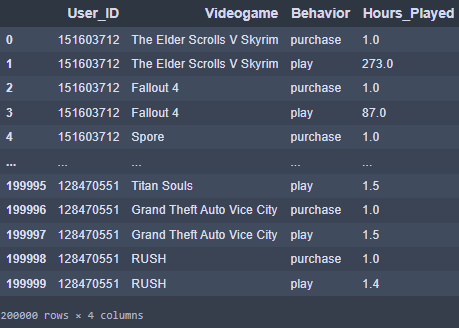
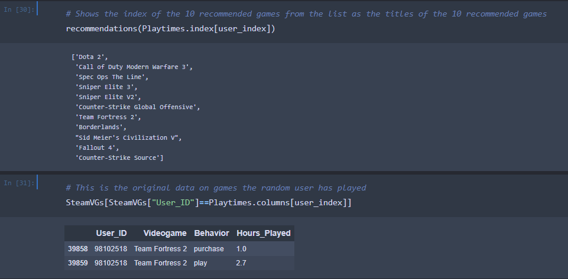

# Videogame-Recommendations-Using-Steam-Data
Recommending the top 10 most similar videogames to Steam users using their playtime from this Kaggle dataset:
https://www.kaggle.com/datasets/tamber/steam-video-games/data


## Introduction 

"Steam is the ultimate destination for playing, discussing, and creating games." 
Steam is a digital videogame service developed by Valve Cortporation to provide updates for their games, but expanded to third-party titles in late 2005 from Triple A games to indie games in 2005. It's a very important and trusted in the gaming space, as well as biggest game catalog storefront. 

## Business Problem

According to Steam's latest user data, there are 132 million monthly active users on Steam. With 73,000 videogames, how do you know what recommend each user? Play it safe with the most popular games? What about trending games? Rating wise? Games are a lot more trickier to recommend to players because they can be the same genre, but be completely different experiences and styles.

After seeing many post online in their community tab and various third party sites complaining about the confusing recommendations leading to endless scrolling for new games, Steam has tasked me to attempt making a greater recommendation system/improve the current one. 

## Limitations

In the dataset, there are no limitations at all. Its a perfectly clean! It's a dataset with exactly 200k rows with everything necessary.

All I need are these 4 variables: 

- User_ID: The ID given to the user's generated Steam account
- Videogame: Name of the game the user interacted with
- Behavior (Purchase): If the row has "purchase" as the behavior, hours played will be 1 (Meaning true, they've bought it)
- Behavior (Play): If the row has "play" as the behavior, number will be how long a user has played the game in decimal form



## Analysis

Using the dataset, I have found out that-

- 12.4k users
- 5,155 videogames
- Purchase count is 129.5k,  Play count is 70.4k
- So there is 59.1k instances of purchasing without playing, honestly very realistic

Outliers -

- Highest purchase count is 1k games (User only played half of them lol) 
- Highest total playtime is 11.7k hour
- Most played game has 980k hours, 2nd most has only 322k
- Most frequent game appeared 9.6k times, second highest is only half of that (4.8k)

Random FYIs -

- 572 users have purchased a game, but never played it
- 1.8k instances of a game being played 6 minutes or less
- 848 games played 6 minutes or less
- 655 games appear once
- Some a thing rows in the data aren't videogames (doesn't affect rec. system)


## Methods

This recommendation system is built on cosine similarity, a way to measure how similar two items are. If you imagine two arrows on a graph, the cosine similarity is the measurement of the angle between them. The smaller the angle of two points, the greater the cosine similarity. 

Applying this to the recommendation system, I plotting data points in a multidimensional space in order to compare each user's playtimes on every videogame to make the similarities. The 10 recommended games are gathered after the program finds vectors with the highest cosine similarities.


## Visualizations

Randomly selected user recommendations comparison to their currently played games. The first table is the recommendations games, and the second table is the user's playtime data in the dataset. 


User 5250's recommendations:


User 98102518's recommendations:


## Conclusion

Looking at these 2 randomly selected users, the games chosen tend to be related to the user's games for the most part. The recommendations follow the user's game's trends on the genre and the length of the game. When a user plays a lot racers, they get racing recommendations, they play a lot of indies, they get indies recommendations, etc. The same thing goes for the length of the games. Depending on if the user plays a lot of short, long, open-ended, or replayable games, that also tunes the recommendations in the end for the better.

 Although data is still very implicit and can sometimes miss the object for fitting recommendations, playtime seems way more reliable for recommending similar games for users of all shapes and sizes compared to popularity/rating/genre/tags/etc.  This is a recc system that would definitely keep up in real-time as user's data updates from buying new games.

## Future Analysis

Before getting into next steps, I want to say that the recommendation system works great already. This is a very fine system that could serve as a baseline to be built up on. There a lot of ideas I had using data already on Steam user's accounts/games  already. When it comes improving this sytem in the future, there would be significant improvements in this if we-
- Categorizing games by the length of the game. (short games, long games, replayable, and open-ended games)
- Keeping overall playtime, also adding first 14 days of the purchase playtime, playtime in the last 14 days in real-time
- Categorize games by developer status like Triple A, Indie, and everything in between, or maybe followed/frequent developers
- Finding this out last minute on a random run, but DON'T recommend a game someone has played already.

## For More Info

If you want to see the way the code functions in my Notebook, click [here](https://github.com/MansionAnthony/Videogame-Recommendations-Steam/blob/main/Playtime%20Rec%20System.ipynb)

If you want to see my presentation made from this, click [here](https://github.com/MansionAnthony/Videogame-Recommendations-Steam/blob/main/Presentation.pdf)

Link to the Kaggle dataset used [here](https://www.kaggle.com/datasets/tamber/steam-video-games/data)

## Repository Structure

```
|— Data                                                      <- Folder holding data downloaded from kaggle
|— .gitignore                                                <- Ignoring irrelevant files
|— 5250.png                                                  <- User 5250's recommendations
|— 98102518.png                                              <- User 98102518's recommendations
|— Playtime Rec System.ipynb                                 <- The notebook with the recommendations by playtime 
|— README.md                                                 <- The awesome file letting you read this organized
|— presentation.pdf                                          <- Google Sldies presentation made from this
```
